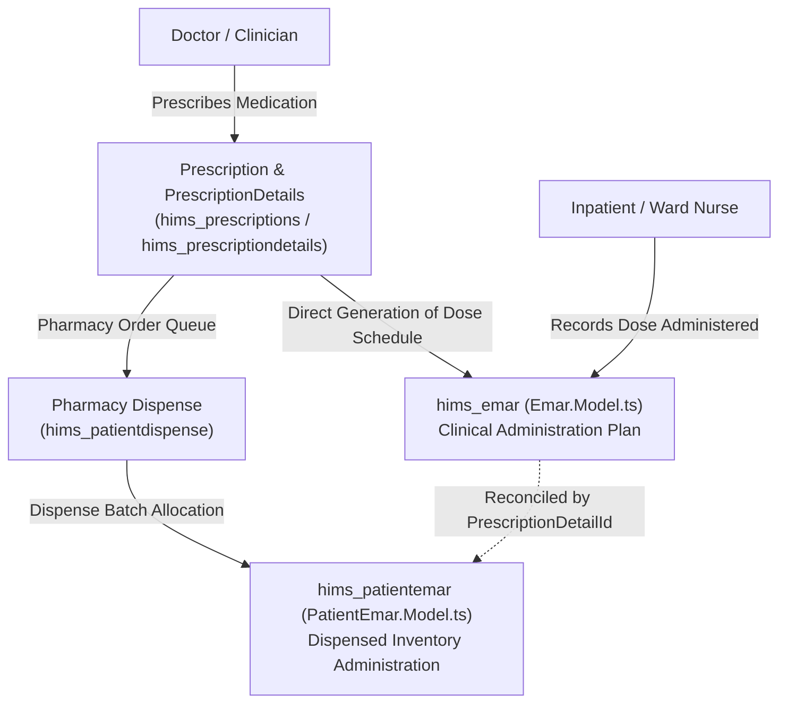

# Clinical Status Enums & Dual EMAR Architecture Reconciliation

**Document Version:** 1.0  
**Target Module:** EMR, Pharmacy & Clinical Administration  
**Specification References:** EMR Modernization Spec v2.1 (B1-05, B1-06), Blueprint Contracts (EMR-02, MED-03, eMAR-01)

---

## 1. Canonical ReferenceValue Status Enums (B1-05)

The HIMS application uses the `referencevalues` database table for extensible lookup tables mapped across modules. Below is the canonical inventory of active status codes and group mappings:

### 1.1 Clinical Entity Statuses (`ActiveStatus`)
| ReferenceValueCodeId | Code | Description | Usage & Clinical Lifecycle Rules |
| :--- | :--- | :--- | :--- |
| **1** | `Draft` | Draft / In-Progress | Entity can be modified, edited in place, or deleted without amendment audit. |
| **2** | `Active` | Active / Finalized / Signed | Entity is active and in effect. In clinical notes, triggers immutability (`NoteStatus = 2`). |
| **3** | `Inactive` | Inactive / Soft-Deleted | Entity is inactive or superseded. |

### 1.2 Prescription Status Lifecycle (`PrescriptionStatus`)
| Status ID | Status Code | Description | Lifecycle Gate |
| :--- | :--- | :--- | :--- |
| **1** | `Draft` | Draft Prescription | Unsaved / editing in clinical interface. |
| **2** | `Saved` | Saved Prescription | Saved by doctor, not yet ordered to pharmacy. |
| **3** | `Prescribed` | Prescribed & Dispatched | Finalized by clinician, generates prescription identifier, dispatches to pharmacy order queue. |
| **4** | `Dispensed` | Fully Dispensed | Pharmacy has filled and dispensed all medications. |
| **5** | `Cancelled` | Cancelled / Discontinued | Prescription discontinued or cancelled with clinical reason. |

### 1.3 Clinical Notes Lifecycle (`ClinicalNotesStatus`)
| Status ID | Code | Description | Immutability Rule |
| :--- | :--- | :--- | :--- |
| **1** | `Draft` | Draft Note | Editable by author. |
| **2** | `Signed` | Signed Note | Frozen `SignedContent`, `SignedBy`, `SignedAt`. Direct mutations rejected. |
| **3** | `Amended` | Amended Note | Original note marked as Amended when an addendum/amendment is saved via `AmendmentOf`. |
| **4** | `EnteredInError` | Entered in Error | Clinically marked as erroneous with documented justification; never physically deleted. |

### 1.4 Electronic Medication Administration Status (`eMARStatus` / `AdministerStatus`)
| Status ID | Code | Description | Timing & Role |
| :--- | :--- | :--- | :--- |
| **1** | `Scheduled` | Scheduled for Admin | Future scheduled dose generated from prescription duration & frequency. |
| **2** | `Given` | Given / Administered | Dose administered to patient by nurse with batch/timestamp verification. |
| **3** | `Held` | Held / Withheld | Dose withheld due to clinical contraindication, vital signs out of range, or doctor order. |
| **4** | `Refused` | Refused by Patient | Patient or guardian refused medication. |
| **5** | `Missed` | Missed Dose | Scheduled administration window expired without recording. |

---

## 2. Dual EMAR Model Architecture Reconciliation (B1-06)

In the HIMS repository, two distinct EMAR models exist in `api/src/Server/Modules/EMR/Model/`:
1. `Emar.Model.ts` (`hims_emar`)
2. `PatientEmar.Model.ts` (`hims_patientemar`)

This section documents their architectural responsibilities, data flow, and reconciliation rules:

### 2.1 Model Contrast & Boundaries

| Attribute / Feature | `hims_emar` (`Emar.Model.ts`) | `hims_patientemar` (`PatientEmar.Model.ts`) |
| :--- | :--- | :--- |
| **Primary Key** | `EmarId` | `PatienteMARId` |
| **Core Purpose** | **Clinical Dose Scheduling:** Created immediately when a doctor prescribes medication with `IseMAR = true`. Generates day-by-day scheduled dose slots (Morning, Noon, Night) across the duration. | **Pharmacy Dispense Tracking:** Created when hospital pharmacy dispenses physical items (batches, lots, serials) against the prescription. |
| **Key Relationships** | `PrescriptionId`, `PrescriptionDetailId`, `PatientId`, `EncounterId` | `PrescriptionDetailId`, `PatientDispenseId`, `ItemMasterId`, `BatchId`, `ExpiryDate` |
| **Workflow Stage** | Point of Clinical Ordering & Ward eMAR Chart display | Point of Pharmacy Stock Issuance & Nurse Bedside Verification |
| **Status Field** | `AdministerStatusId` (Scheduled, Given, Held, Refused, Missed) | `DispensedStatusId` & `eMARStatusId` |

### 2.2 Reconciliation Rule
1. The **Ward eMAR Chart** displays doses driven by `hims_emar`, grouped by date and administration window.
2. When the pharmacy dispenses the medication, the corresponding `hims_patientemar` records link via `PrescriptionDetailId`.
3. When the nurse administers the medication at bedside:
   - If stock was dispensed from pharmacy, the `BatchId` and `PatientDispenseId` from `hims_patientemar` are referenced in the administration record.
   - `AdministeredQuantity`, `AdministeredBy`, `AdministeredDate`, and `AdministerStatusId` are updated in `hims_emar`.
