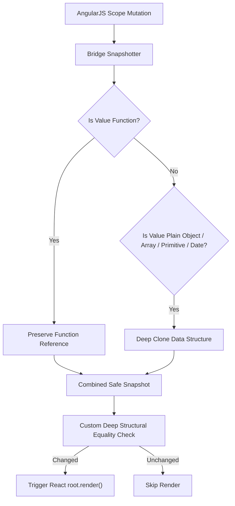

# EMR Module — Complete Development Specification v2.1

**Project:** HIMS — Hospital Information Management System  
**Module:** Electronic Medical Records (EMR)  
**Spec Version:** 2.1 (Pre-Implementation Baseline)  
**Date:** 2026-09-21  
**Status:** ⚠️ IN PROGRESS (Read-Only Planning Phase) — Gated on synthetic runtime verification and SIMPLEX staging capture recovery. No application code was modified.

---

## 0. Version 2.1 Correction Log

| # | Item | What was corrected in v2.1 |
|---|------|----------------------------|
| 1 | **AST State Census** | Counted via AST/regex parsing excluding comments: **163 `patientemr` declarations** = 1 parent (`patientemr`) + 162 child states (`patientemr.*`). Plus 7 cross-cutting `app.*` states in the same file = 170 total `.state()` declarations. |
| 2 | **Declaration vs Runtime Distinction** | Explicitly separated **540 static Express POST route declarations** and **79 Sequelize model files** from runtime-reachable endpoints and verified live database tables. |
| 3 | **PrivilegeHelper Impact** | Traced `PrivilegeHelper.ts` (435+ stubs returning `false` + 7 duplicate keys) as a **client-side React UI gating failure**, distinguished from backend server-side authorization (`AuthMiddleware`, `BaseBo`). |
| 4 | **Callback-Safe Bridge Architecture** | Replaced generic `structuredClone`/`JSON.stringify` proposals with a **callback-safe snapshotter** that deep-clones plain data objects/arrays while preserving function references (`onAction`, event callbacks). |
| 5 | **Blueprint Availability** | Removed outdated "PDF unavailable" claims. Blueprint contracts (EMR-01–05, MED-01–05, ORD-01–05, NUR-01–05) are fully integrated via Poppler `pdftotext` extraction. |
| 6 | **Backlog Reconciliation** | Exactly **31 backlog work packages (B0-01 through B4-05)** reconciled across documentation, CSV, and phase roadmaps. |
| 7 | **React Migration vs Runtime Acceptance** | Added explicit status distinction: *Migrated TSX Component* vs *Runtime-Verified End-to-End*. |
| 8 | **Schema-Validated DB Queries** | Database inspection queries validated against actual `referencevalues` schema (`ReferenceValueId`, `GroupCode`, `ReferenceValueCode`, `ReferenceValueCodeId`, `Description`, `Status`). |
| 9 | **Auth Token Evidence** | Token handling specifically attributed to `src/react-components/utils/APIHelper.ts` (`localStorage.getItem('token')`), distinct from the `apiFetch` utility. |
| 10 | **Unresolved Evidence Gaps** | Preserved RG-02 (SIMPLEX capture loss), RG-03 (runtime validation on synthetic DB), and RG-04/RG-05 as explicit blocking gates. |

---

## 1. Environment & Path Access Confirmation

### 1.1 Verified File Paths

| Path | Access Status | Contents & Purpose |
|------|--------------|-------------------|
| `/Users/sharmila/Rajesh/my-app/` | ✅ Verified Accessible | Complete source tree (`api/`, `src/`, `public/`, `docs/`, `package.json`). |
| `/Users/sharmila/Documents/Codex/2026-09-20/https-staging-simplexworld-com-masterv9-5/outputs/` | ✅ Verified Accessible | Reference deliverables (`healthcare-platform-full-blueprint.pdf`, `main-application-comparison-and-change-plan.md`, `healthcare-module-comparison.csv`, `main-app-static-route-inventory.csv`, `simplex-review-progress.md`). |

---

## 2. Census & Structural Verification

### 2.1 AST-Based State Inventory (`public/js/emr-states.js`)

Parsing of `public/js/emr-states.js` yields **170 total `.state()` declarations**:
- **1 Root Parent State:** `patientemr` (defines patient banner shell, top navigation tabs, and sub-view container).
- **162 Child States:** `patientemr.*` (all clinical encounter child tabs, forms, history views, and specialty screens).
- **7 Cross-Cutting States:** `app.*` declared within the EMR file (`app.abgparameters`, `app.appointmentrequest`, `app.otconsumption`, `app.otconsumptions`, `app.patientfollowuptab`, `app.patientfollowuptab.followup`, `app.patientfollowuptab.pending`).

```mermaid
graph TD
    Root["patientemr (Root Parent Shell)"]
    Root --> Core["Core EMR (Dashboard, PMHx, Records) - 6 states"]
    Root --> Notes["Consultations & Notes (Doctor, Nursing, Symptom, IVF) - 16 states"]
    Root --> Vitals["Vitals & Growth Charts - 4 states"]
    Root --> Dx["Diagnosis & Favorites (ICD-10) - 3 states"]
    Root --> Rx["Prescriptions, Pad & Indents - 11 states"]
    Root --> Orders["Clinical & Procedure Orders - 11 states"]
    Root --> EMAR["EMAR Administration - 2 states"]
    Root --> Charts["Nursing & Specialty Charts (BP, Diabetes, CD4, I/O) - 8 states"]
    Root --> History["Social, Family, Surgical, Immunization - 4 states"]
    Root --> Specialty["Specialty (Dental, Eye, Ortho, Physio, OB/GYN) - 14 states"]
    Root --> Others["Blood Bank, Consent, Discharge, Tasks, Financial - 84 states"]
```



### 2.2 Backend Declarations vs Runtime Reachability

| Asset | Static Code Declarations | Runtime & Physical Verification Status |
|---|---|---|
| **API Endpoints** | **540 POST route declarations** across 97 router files in `api/src/Server/Modules/EMR/Router/` | ⚠️ **Declared, not runtime verified**. All 540 routes follow Express `router.post()` convention. 19 `*.spec.ts` test files excluded. Reachability depends on server bootstrap and RBAC gating. |
| **Database Models** | **79 Sequelize model files** in `api/src/Server/Modules/EMR/Model/` | ⚠️ **Declared in code**. 79 models map 1:1 to physical table definitions. Live schema integrity, foreign keys, and indexes require live DB connectivity check. |
| **React Components** | **13 EMR-adjacent React components** in `src/main.tsx` | ⚛️ **Static TSX components present**. None are runtime-accepted end-to-end (see Section 6). |

---

## 3. Security, Permissions & Concurrency Analysis

### 3.1 PrivilegeHelper vs. Server Authorization

* **Client-Side UI Gating (`src/react-components/utils/PrivilegeHelper.ts`):**
  - Contains 435+ exported helper methods that hardcode `return false;`.
  - Contains **7 duplicate object keys** causing TypeScript compiler errors (TS1117).
  - **Impact:** React components attempting to check client-side action permissions (e.g. `CanEdit`, `CanDelete`) fail or hide controls prematurely.
* **Server-Side Authorization (`api/src/Server/`):**
  - Managed independently via Express `AuthMiddleware` and `BaseBo`.
  - **Critical Gap F05:** EMR `Get*` endpoints lack patient-facility scoping checks (a user with a valid token can query any `PatientId` across facilities).

### 3.2 Authentication Token Storage Evidence

* Direct inspection of `src/react-components/utils/APIHelper.ts` (lines 42, 108, 135, 165, 195, 226) confirms:
  ```typescript
  const token = localStorage.getItem('token');
  ```
* **Security Risk:** Storing bearer tokens in `localStorage` exposes them to XSS exfiltration.
* **Required Fix (B0-03):** Migrate session handling to `httpOnly` secure cookies.

### 3.3 Concurrency & Optimistic Locking

* All 79 models declare a `Rev: { type: DataTypes.INTEGER, field: 'Rev' }` column.
* **Finding F11:** The `BaseBo.Update()` method supports optimistic locking, but checking `Rev` is currently **opt-in** by the caller. Concurrent updates to clinical notes, vitals, and orders default to last-write-wins unless `Rev` validation is strictly enforced.

---

## 4. Callback-Safe React Bridge Architecture

### 4.1 Root Cause of Defect F07 (`src/reactBridge.tsx`)

The current implementation in `src/reactBridge.tsx`:
```typescript
function clonePropsSnapshot(obj: any): any {
  if (!obj || typeof obj !== 'object') return obj;
  const clone: any = { ...obj };
  if (obj.reactProps && typeof obj.reactProps === 'object') {
    clone.reactProps = { ...obj.reactProps };
    if (obj.reactProps.privileges && typeof obj.reactProps.privileges === 'object') {
      clone.reactProps.privileges = { ...obj.reactProps.privileges };
    }
  }
  return clone;
}

function isPropsSnapshotEqual(objA: any, objB: any): boolean {
  try {
    return JSON.stringify(objA) === JSON.stringify(objB);
  } catch (e) {
    return false;
  }
}
```

**Why generic deep clone (`structuredClone` or `JSON.stringify`) fails:**
1. `structuredClone()` throws `DataCloneError` when encountering callback functions (such as `onAction`, `dispatch`, `onClick`).
2. `JSON.stringify()` silently strips function properties and converts `undefined` to `null` or omits keys.
3. Shallow cloning leaves nested data structures (e.g. `reactProps.item.PrescriptionDetails`, `reactProps.currentcontext.isPatientHasAllergy`) sharing object references. In-place mutations on the AngularJS scope modify the previous snapshot directly, causing `isPropsSnapshotEqual` to return `true` and blocking UI re-renders.

### 4.2 Callback-Safe Snapshot Architecture (H-04 / B0-06)



**Implementation Pattern:**
```typescript
export function safePropsSnapshot(obj: any, seen = new WeakMap()): any {
  if (obj === null || typeof obj !== 'object') {
    return obj;
  }
  if (typeof obj === 'function') {
    return obj; // Preserve callback reference
  }
  if (obj instanceof Date) {
    return new Date(obj.getTime());
  }
  if (seen.has(obj)) {
    return seen.get(obj);
  }

  if (Array.isArray(obj)) {
    const arrCopy: any[] = [];
    seen.set(obj, arrCopy);
    for (let i = 0; i < obj.length; i++) {
      arrCopy[i] = safePropsSnapshot(obj[i], seen);
    }
    return arrCopy;
  }

  const objCopy: Record<string, any> = {};
  seen.set(obj, objCopy);
  for (const key of Object.keys(obj)) {
    objCopy[key] = safePropsSnapshot(obj[key], seen);
  }
  return objCopy;
}

export function isSafeEqual(a: any, b: any): boolean {
  if (Object.is(a, b)) return true;
  if (typeof a !== typeof b) return false;
  if (typeof a === 'function' && typeof b === 'function') return a === b;
  if (a instanceof Date && b instanceof Date) return a.getTime() === b.getTime();
  if (typeof a !== 'object' || a === null || typeof b !== 'object' || b === null) return false;

  const keysA = Object.keys(a);
  const keysB = Object.keys(b);
  if (keysA.length !== keysB.length) return false;

  for (const key of keysA) {
    if (!Object.prototype.hasOwnProperty.call(b, key)) return false;
    if (!isSafeEqual(a[key], b[key])) return false;
  }
  return true;
}
```

---

## 5. Blueprint Domain Reconciliation (EMR, MED, ORD, NUR)

Full text extracted from `healthcare-platform-full-blueprint.pdf` via Poppler `pdftotext`:

### 5.1 EMR — Clinical Chart and Documentation (EMR-01 to EMR-05)

| Blueprint Contract | Scope & Intent | HIMS Current Status | Gap Classification |
|---|---|---|---|
| **EMR-01 Longitudinal Chart** | Unified timeline of encounters, problems, allergies, medicines, vitals, and notes. | Discrete tabs exist under `patientemr.*`; no unified chronological view. | **Partial (P-03 / N-10)** |
| **EMR-02 Consultation Note** | Structured SOAP notes, draft saving, explicit signing, immutable signed records, linked amendments. | `PatientClinicalNotesBo` overwrites in place; no signing/amendment model. | **Defect / New (F10, N-01, N-02)** |
| **EMR-03 Problem & Allergy Lists** | Active/resolved problem lists with ICD coding; allergy severity and verification. | `patientdiagnosis` and `patientallergies` exist. Soft-delete only; no amendment trail. | **Partial (P-09, N-06)** |
| **EMR-04 Template & Specialty Forms** | Governed clinical note templates with versioning and facility-based activation. | 14 specialty modules exist in code; all enabled by default; no versioning. | **New Governance (N-13, B4-02)** |
| **EMR-05 Clinical Inbox** | Central worklist for pending results, unsigned notes, and overdue tasks. | `emrtaskmanagementlist` exists in Angular; no clinical result escalation inbox. | **Partial (N-09)** |

### 5.2 MED — Prescribing and Medication Safety (MED-01 to MED-05)

| Blueprint Contract | Scope & Intent | HIMS Current Status | Gap Classification |
|---|---|---|---|
| **MED-01 Medication Reconciliation** | Reconcile home vs inpatient meds; document status/discontinuation reasons. | `patientadvicemedications` and `patientdischargemedications` exist; reconciliation flow partial. | **Partial (N-07)** |
| **MED-02 Prescription Composer** | Dimensional dosing, frequency, route, duration, indication, order versioning. | `DoctorPrescribeFormScreen.tsx` has header; buttons hidden (F09); drug lines in Angular. | **Defect / Partial (D-01, P-01)** |
| **MED-03 Safety Review** | Allergy matching, duplicate therapy warnings, mandatory override reason logging. | `isPatientHasAllergy` flag in UI; no override audit trail table. | **New (N-06, B1-04)** |
| **MED-04 Issue & Amendments** | Signed Rx document generation, pharmacy dispatch, linked order amendments. | `PrintPrescription` exists; order amendment creates new Rx rather than linked version. | **Partial (P-08)** |
| **MED-05 Formulary Administration** | Generic/brand catalog, shortage alternatives, restricted drug governance. | `ClinicalMaster` contains drug master; no automated restriction rules. | **Existing Baseline** |

### 5.3 ORD & NUR — Orders, Results & Nursing Administration

* **ORD-01 to ORD-05:** `PatientOrderRoute` and `PatientOrderDetailRoute` handle order capture; `ClinicalPendingOrdersListScreen.tsx` and `OrderTrackerScreen.tsx` provide tracking. Missing: structured critical result read-back worklist.
* **NUR-01 to NUR-05:** `NursingDashboardComponent.tsx` provides ward overview; specialty nursing charts exist in Angular. Missing: structured shift handover view (N-08) and dual-table EMAR consolidation (OQ-04 / B1-06).

---

## 6. React Component Status vs Runtime Acceptance

| Component | Target Screen / State | Static TSX Status | Runtime & Bridge Status | Acceptance Gate |
| :--- | :--- | :--- | :--- | :--- |
| `DoctorPrescribeFormScreen.tsx` | `patientemr.prescribetab` | ⚛️ Migrated (Header only) | ❌ **Defective (F09, F08)** — Action buttons hidden; date minus 1 day in IST. | Gate B (B0-08, B0-07) |
| `PrescriptionsListScreen.tsx` | Global Prescriptions List | ⚛️ Migrated | ⚠️ Static code complete; requires runtime query verification. | Gate B |
| `ClinicalPendingOrdersListScreen.tsx`| Clinical Pending Orders | ⚛️ Migrated | ⚠️ Static code complete; bridge data binding unverified. | Gate B |
| `NursingDashboardComponent.tsx` | Inpatient Ward Dashboard | ⚛️ Migrated | ⚠️ Static code complete; ward filter binding unverified. | Gate C |
| `OrderTrackerScreen.tsx` | Order Lifecycle Tracker | ⚛️ Migrated | ⚠️ Static code complete; status updates unverified. | Gate B |
| `PendingOrderPickerScreen.tsx` | Order Selection Modal | ⚛️ Migrated | ⚠️ Static code complete; modal return callback unverified. | Gate B |
| `CurrentInpatientScreen.tsx` | Inpatient Bed View | ⚛️ Migrated | ⚠️ Static code complete; bed transfer trigger unverified. | Gate C |
| `CurrentInpatientListScreen.tsx` | Current Inpatient List | ⚛️ Migrated | ⚠️ Static code complete. | Gate C |
| `AllInpatientListScreen.tsx` | All Inpatient Registry | ⚛️ Migrated | ⚠️ Static code complete. | Gate C |
| `MyInpatientListScreen.tsx` | Doctor Assigned Inpatients | ⚛️ Migrated | ⚠️ Static code complete. | Gate C |
| `PatientDischargeListScreen.tsx` | Discharge Workflow List | ⚛️ Migrated | ⚠️ Static code complete. | Gate C |
| `PendingDischargesScreen.tsx` | Pending Discharge Queue | ⚛️ Migrated | ⚠️ Static code complete. | Gate C |
| `InpatientTabScreen.tsx` | Inpatient Container Shell | ⚛️ Migrated | ⚠️ Static code complete. | Gate C |

---

## 7. Schema-Validated Master Data Queries

To inspect reference status values in MySQL without schema mismatch errors, use the verified table and column structure:

```sql
-- Query master statuses for Prescriptions and Progress Notes
SELECT 
    rv.ReferenceValueId,
    rvg.GroupCode AS GroupCode,
    rv.ReferenceValueCode,
    rv.ReferenceValueCodeId,
    rv.Description,
    rv.IsActive,
    rv.Status
FROM referencevalues rv
INNER JOIN referencevaluegroups rvg 
    ON rv.ReferenceValueGroupId = rvg.ReferenceValueGroupId
WHERE rvg.GroupCode IN ('PrescriptionStatus', 'ProgressNoteStatus', 'AllergySeverity', 'DiagnosisStatus')
  AND rv.Status = 1
ORDER BY rvg.GroupCode, rv.DisplayOrder;
```

---

## 8. Prioritized Implementation Backlog (31 Items)

The implementation backlog contains exactly **31 work packages** across 5 delivery phases:

```
Phase 0: Security, Compilation & Bridge Foundation (9 items: B0-01 to B0-09)
Phase 1: Clinical Safety, Signing Lifecycle & Test Harness (7 items: B1-01 to B1-07)
Phase 2: Core Clinical Encounter React Migration (6 items: B2-01 to B2-06)
Phase 3: Nursing, EMAR & Ward Workflows (4 items: B3-01 to B3-04)
Phase 4: Specialty Governance & Longitudinal Chart (5 items: B4-01 to B4-05)
Total = 31 Items
```

| ID | Phase | Deliverable Title | Owner | Pri | Dependencies | Source Evidence |
| :--- | :--- | :--- | :--- | :--- | :--- | :--- |
| **B0-01** | Phase 0 | Fix PrivilegeHelper stub returns & 7 duplicate keys | Frontend | P0 | None | `src/react-components/utils/PrivilegeHelper.ts` |
| **B0-02** | Phase 0 | Restrict CORS wildcard in Express router | Backend Sec | P0 | None | `api/src/Server/Router.ts:36` |
| **B0-03** | Phase 0 | Move bearer token from localStorage to httpOnly cookie | Backend Sec | P0 | None | `src/react-components/utils/APIHelper.ts:42` |
| **B0-04** | Phase 0 | Create standard `api/.env` runtime configuration | DevOps | P0 | None | `api/` configuration |
| **B0-05** | Phase 0 | Resolve TypeScript compile errors (`tsc --noEmit`) | Frontend | P0 | B0-01 | `tsconfig.app.json` |
| **B0-06** | Phase 0 | Implement callback-safe deep React bridge snapshotter | Frontend | P1 | B0-05 | `src/reactBridge.tsx:24-67` |
| **B0-07** | Phase 0 | Fix date timezone shift (-1 day in IST) in React screens | Frontend | P1 | None | `DoctorPrescribeFormScreen.tsx:75-94` |
| **B0-08** | Phase 0 | Fix prescription action matrix & status gating | Fullstack | P1 | B0-06, B0-07 | `DoctorPrescribeFormScreen.tsx:414` |
| **B0-09** | Phase 0 | Add patient-facility authorization to EMR Get* routes | Backend | P1 | None | `api/src/Server/Modules/EMR/Router/*.ts` |
| **B1-01** | Phase 1 | Signed note lifecycle for PatientClinicalNotes (F10) | Backend/DBA | P1 | DB Migration | `PatientClinicalNotesBo.ts:10` |
| **B1-02** | Phase 1 | Enforce Rev optimistic concurrency across clinical updates | Backend | P1 | B1-01 | `api/src/Server/Base/Business/BaseBo.ts` |
| **B1-03** | Phase 1 | Patient context confirmation gate on high-impact actions | Frontend | P1 | B0-06 | `src/reactBridge.tsx` |
| **B1-04** | Phase 1 | Allergy override audit logging | Backend | P1 | B1-01 | `api/src/Server/Modules/EMR/Router/PrescriptionRoute.ts`|
| **B1-05** | Phase 1 | Document & publish ReferenceValue status enums | Backend/DBA | P1 | Schema Query | `referencevalues` table |
| **B1-06** | Phase 1 | Reconcile dual EMAR models (`hims_emar` vs `patientemar`) | Backend/DBA | P1 | None | `Emar.Model.ts` vs `PatientEmar.Model.ts` |
| **B1-07** | Phase 1 | Synthetic test harness for clinical workflows (CI/CD) | QA Platform | P1 | B0-05 | `.github/workflows/` |
| **B2-01** | Phase 2 | Vital Signs React form & trend chart migration | Frontend | P1 | B0-06, B0-07 | `PatientVitalRoute.ts`, `hims_patientvitals` |
| **B2-02** | Phase 2 | Allergy form & persistent alert banner migration | Frontend | P1 | B0-06, B1-04 | `PatientAllergyRoute.ts`, `patientallergies` |
| **B2-03** | Phase 2 | Diagnosis entry & ICD-10 history migration | Frontend | P1 | B0-06, B0-07 | `PatientDiagnosisRoute.ts`, `patientdiagnosis`|
| **B2-04** | Phase 2 | Prescription drug line items (`PrescriptionDetail`) | Frontend | P1 | B0-08 | `PrescriptionDetailRoute.ts` |
| **B2-05** | Phase 2 | Clinical order entry form migration | Frontend | P1 | B0-06 | `PatientOrderRoute.ts`, `patientorders` |
| **B2-06** | Phase 2 | Persistent patient identity & allergy banner shell | Frontend | P1 | B0-06 | `patientemr` root shell |
| **B3-01** | Phase 3 | EMAR administration screen (dose/time/witness/omission) | Frontend | P1 | B1-06, B1-02 | `EmarRoute.ts`, `hims_emar` |
| **B3-02** | Phase 3 | Nursing shift handover view | Frontend | P2 | B3-01 | `PatientClinicalNotesBo.ts` |
| **B3-03** | Phase 3 | Intake/Output chart React migration | Frontend | P2 | B0-06 | `IntakeOutputChartRoute.ts` |
| **B3-04** | Phase 3 | Nursing daily notes editor React migration | Frontend | P2 | B0-06, B1-01 | `DailyNoteRoute.ts`, `hims_dailynotes` |
| **B4-01** | Phase 4 | Longitudinal patient timeline across encounters | Fullstack | P2 | B2-01 to B2-06 | `patientemr.emrdashboard` |
| **B4-02** | Phase 4 | Specialty workflow activation governance | Backend/DBA | P2 | `SystemSettings` | `FacilityPreference` |
| **B4-03** | Phase 4 | Dental tooth chart React migration | Frontend | P3 | B4-02 | `PatientToothChartRoute.ts`, `toothcharts` |
| **B4-04** | Phase 4 | Physiotherapy treatment React migration | Frontend | P3 | B4-02 | `PhysiotheraphyTreatementRoute.ts` |
| **B4-05** | Phase 4 | Country pack architecture (UAE / Nepal governance) | Architecture | P3 | B0-02, B0-03 | `UaeBillingPaymentScreen.tsx` |

---

## 9. Developer Handoff Prompts

### Handoff H-01: Fix F09 Prescription Action Matrix (Defect Fix)
```
CONTEXT : HIMS EMR — Bug Fix (Phase 0 / Gate A)
FILES   : src/react-components/DoctorPrescribeFormScreen.tsx (lines 414-450)
          public/views/emr/registration/prescriptions/doctorprescribe-form.js (lines 51, 1163)
DEFECT  : canShowSaveBtn, canShowPrescribeBtn, canShowPrescribeOrderBtn are always falsy.
          Save and Prescribe buttons never appear in React UI.
TASK    :
  1. In AngularJS controller (doctorprescribe-form.js), compute flags based on user role + statusId.
  2. Pass flags explicitly inside reactProps.
  3. On server (PrescriptionRoute.ts), reject update calls if PrecriptionStatusId = 2 (Signed) or 3 (Dispensed).
  4. Fix BUG 4: wire ismodal from currentcontext to control Back/Save-as-Rx-Panel visibility.
ACCEPT  : Clinician with role=Doctor and statusId=0 sees Save button; statusId=3 sees Print/Cancel only.
          Server rejects unauthorized state mutations with HTTP 403.
```

### Handoff H-02: Fix F08 Date Timezone Shift (-1 Day in IST)
```
CONTEXT : HIMS EMR — Date Handling Bug Fix (Phase 0 / Gate A)
FILES   : src/react-components/DoctorPrescribeFormScreen.tsx (lines 75-94)
          All future React date pickers
DEFECT  : date.toISOString().slice(0, 10) converts local midnight IST (UTC+5:30) to prior day UTC.
TASK    :
  Replace toISOString().slice(0, 10) with local date formatting:
    const toDateInputValue = (d: string | Date | undefined): string => {
      if (!d) return '';
      const dt = d instanceof Date ? d : new Date(d);
      if (isNaN(dt.getTime())) return '';
      const y = dt.getFullYear();
      const m = String(dt.getMonth() + 1).padStart(2, '0');
      const day = String(dt.getDate()).padStart(2, '0');
      return `${y}-${m}-${day}`;
    };
ACCEPT  : Selecting 2026-09-20 in Asia/Kolkata timezone outputs '2026-09-20' (not '2026-09-19').
```

### Handoff H-03: Signed Clinical Note Lifecycle (Phase 1 / Gate B)
```
CONTEXT : HIMS EMR — Schema Migration & Business Logic (F10 / EMR-02)
FILES   : api/src/Server/Modules/EMR/Model/PatientClinicalNotes.Model.ts
          api/src/Server/Modules/EMR/Business/PatientClinicalNotesBo.ts
          api/src/Server/Modules/EMR/Router/PatientClinicalNotesRoute.ts
TASK    :
  1. Add schema fields to hims_patientclinicalnotes:
     - SignedAt (DATETIME, nullable)
     - SignedBy (BIGINT, nullable FK to User)
     - SignedContent (LONGTEXT, nullable)
     - NoteStatus (INTEGER, 1=Draft, 2=Signed, 3=Amended, 4=EnteredInError)
     - AmendmentOf (BIGINT, nullable FK self-ref)
     - AmendmentReason (VARCHAR(500), nullable)
  2. Implement SignPatientClinicalNote: freeze SignedContent = current content, NoteStatus = 2.
  3. UpdatePatientClinicalNotes: reject with 403 if NoteStatus >= 2.
  4. Implement AmendPatientClinicalNote: create linked record with AmendmentOf = original Id.
ACCEPT  : Signed note content is immutable. Amendments preserve original and linked revisions.
```

### Handoff H-04: Callback-Safe React Bridge Implementation (Phase 0 / Gate A)
```
CONTEXT : HIMS UI Modernization — Bridge Deep Equality (F07)
FILE    : src/reactBridge.tsx
TASK    :
  1. Replace shallow clonePropsSnapshot with safePropsSnapshot (recursively copies data objects,
     arrays, primitives, and Dates while preserving function references).
  2. Replace JSON.stringify equality with isSafeEqual (deep structural comparison supporting functions).
  3. Ensure in-place mutations of reactProps.item or reactProps.currentcontext on AngularJS scope
     trigger React re-renders without dropping onAction callbacks.
ACCEPT  : In-place scope mutation triggers React re-render. Component callbacks (onAction) remain functional.
```

---

## 10. Residual Evidence Gaps & Acceptance Gates

| Gap ID | Description | Blocking Severity | Resolution Gate |
|:---|:---|:---|:---|
| **RG-02** | SIMPLEX staging screen captures for ~30 specialty EMR screens marked "not preserved". | 🟠 High (Specialty UI) | **Gate D** — Reconcile specific specialty fields with clinical leads prior to Phase 4. |
| **RG-03** | 11 runtime items (R-01 to R-11) require live database execution validation. | 🔴 Critical (Clinical Safety) | **Gate B** — Execute synthetic database integration tests (B1-07) before clinical pilot. |
| **RG-04** | Master `ReferenceValue` entries for status enums require direct database inspection. | 🟡 Medium (Master Data) | **Gate A / Phase 1** — Execute validated SQL query against `referencevalues` (B1-05). |
| **RG-05** | Dual EMAR tables (`hims_emar` vs `patientemar`) require database data inspection. | 🟡 Medium (Data Model) | **Gate C / Phase 3** — Consolidate or document split prior to EMAR React migration (B1-06). |

---

*Read-only specification. No application code was modified.*  
*Specification remains in IN PROGRESS status until Gate A and Gate B acceptance gates are verified.*
